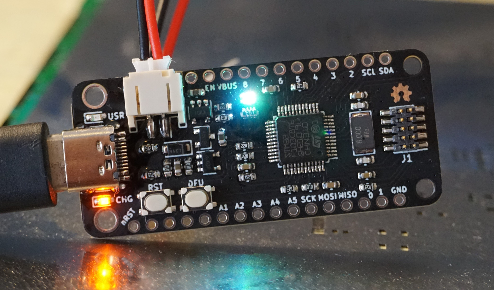

# STM32F103 Feather

## STM32F103 in an Adafruit Feather form factor.
- STM32F103 MCU
- USB type C connector
- SWD Header
- RGB LED
- Designed to work with my [RF Signal Generator](https://github.com/joshajohnson/rf-sig-gen)

### TODO

#### Hardware
- [ ] Optimise pin mapping for V0.2 (SPI1 CS incorrecly positioned, may be other issues)

#### Firmware
- [ ] Improved demo code
- [ ] PWM control drivers for RGB LED
- [ ] USB Bootloader
- [ ] Add to Arduino framework with STM32Duino
- [ ] Add Black Magic Probe support?